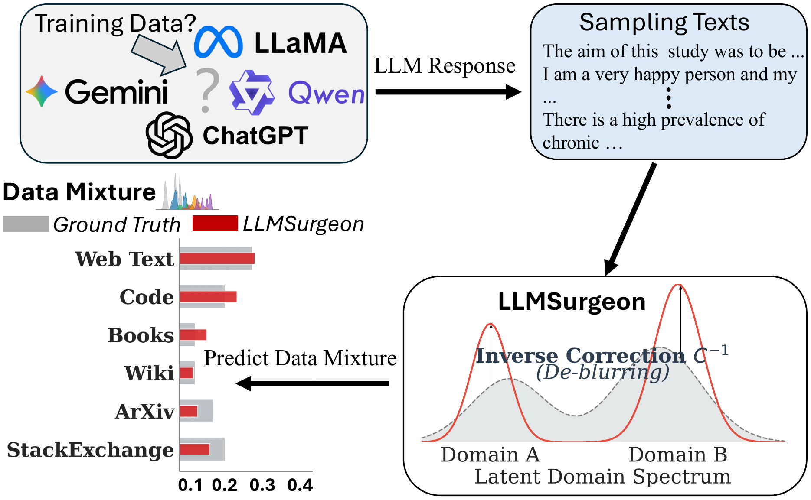
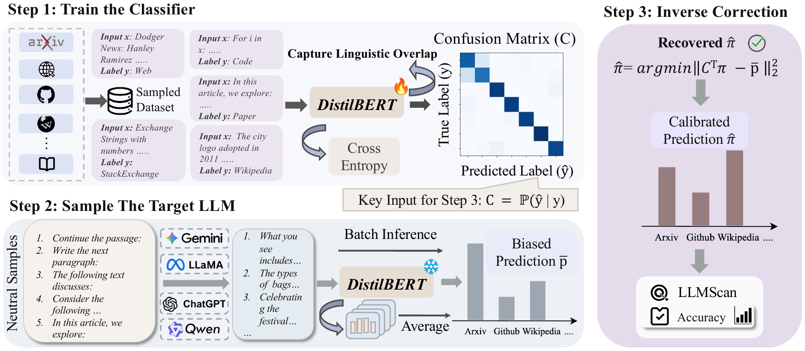
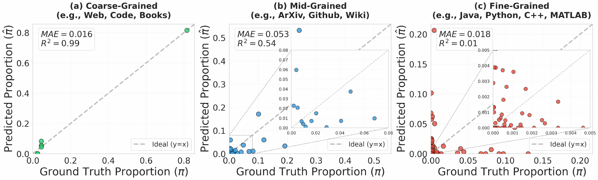
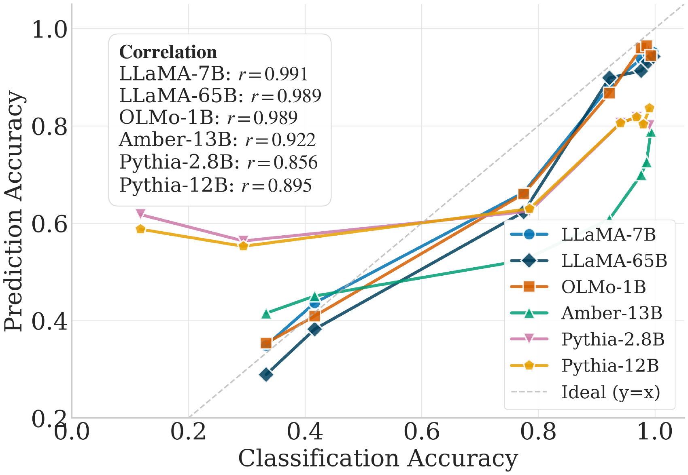
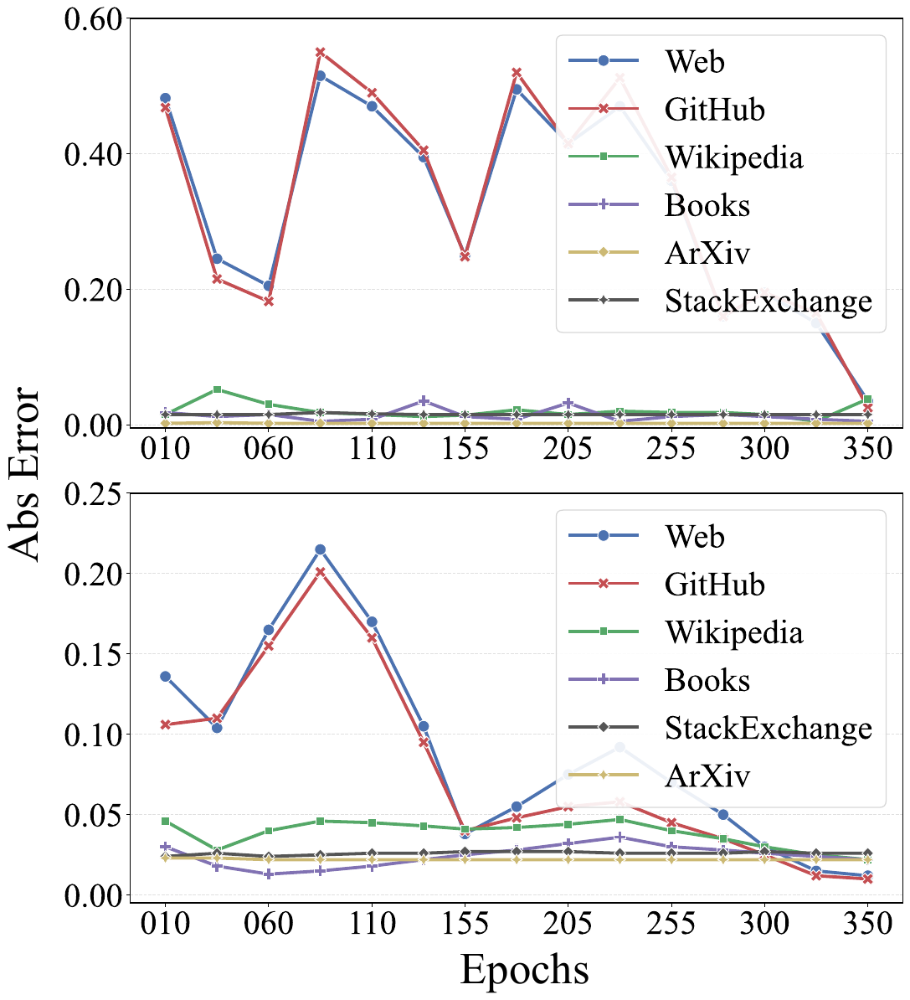

<!-- TODO before public release:
     * Replace <org> with the GitHub org/user that owns the repo
     * Replace arxiv:TBD with the real arXiv ID
-->

<div align="center">

# 🩺 LLMSurgeon

**Diagnosing Data Mixture of Large Language Models**

[](https://arxiv.org/abs/TBD)
[](https://arxiv.org/abs/TBD)
[](LICENSE)
[](https://www.python.org/downloads/)

*Recover the pretraining data mixture of any LLM from only its generated text — no weights, no training data.*

<p>
  <a href="#-what-is-llmsurgeon">What it does</a> •
  <a href="#-main-results">Results</a> •
  <a href="#-installation">Install</a> •
  <a href="#-quick-start">Quick start</a> •
  <a href="#-reproducing-the-paper">Reproduce</a> •
  <a href="#-citation">Cite</a>
</p>


</div>

---

## 📰 News

- **2026.04 ·** Paper accepted to **ACL 2026 Main**. Code and LLMScan benchmark released.

---

## 🎯 What is LLMSurgeon?

The pretraining mixture of a Large Language Model is its *digital DNA* — yet
it is almost never disclosed. LLMSurgeon tackles the inverse problem:

> **Data Mixture Surgery (DMS):** given only text *generated* by a target
> LLM, estimate the domain-level composition of its pretraining corpus under
> a predefined taxonomy.

Naively averaging a domain classifier's predictions over generated text is
biased — the classifier systematically confuses semantically similar domains
(e.g. CommonCrawl ↔ C4, C ↔ C++). **LLMSurgeon corrects this bias**:

1. Train a proxy domain classifier on labelled reference data.
2. Estimate a *calibrated soft confusion matrix* that captures the
   classifier's systematic mistakes.
3. Solve a **constrained inverse problem under the label-shift assumption**
   to de-blur the biased predictions and recover the true latent prior.

<p align="center"></p>

**Why it matters.** LLMSurgeon shifts the goal of data auditing from
*instance-level* membership inference (is *this* document in the training
set?) to *corpus-level* distribution recovery (what is the *global mixture*
the model was trained on?) — a task operators, evaluators, and regulators
actually care about.

---

## 📊 Main Results

### Headline numbers on LLMScan (overlap accuracy, higher is better)

| Granularity | Model | LLMSurgeon | Best baseline |
| --- | --- | --- | --- |
| Coarse | OLMo-1B | **94.46** | 44.1 |
| Coarse | LLaMA-1 7B | **95.14** | 47.8 |
| Coarse | LLaMA-1 65B | **94.26** | 47.9 |
| Coarse | Amber-13B | **78.87** | 42.4 |
| Mid | GPT-Neo 2.7B | **61.86** | 48.9 |
| Mid | Pythia 2.8B | **63.20** | 49.0 |
| Mid | Pythia 12B | **65.98** | 50.3 |
| Fine | StarCoder 15.5B | **30.37** | 22.7 |

> **Overlap accuracy** is the complement of total-variation distance:
> `Acc = 1 − ½ · Σ_c |e_c − g_c|` for estimated mixture `e` and ground
> truth `g`. It equals 1.0 when the two distributions are identical and
> decays linearly as probability mass is misplaced.

Across 11 strong MIA / aggregation baselines (Min-K%, Min-K%++, ReCaLL,
zlib, Neighborhood, DC-PDD, DUCI, Joint-Logit, Loss, Ref, GradNorm),
LLMSurgeon improves coarse-grained recovery by **46–55 points** and is the
only method that remains competitive as the taxonomy gets finer.

### Granularity hierarchy

<p align="center"></p>

Coarse-grained recovery is near-perfect (R² = 0.99). Fine-grained recovery
degrades (R² = 0.01 on StarCoder's 86-language taxonomy) because the
classifier's own confusion between similar categories (C vs. C++, JavaScript
vs. TypeScript) becomes the bottleneck. See §5 of the paper.

### Classifier quality drives estimation quality

<p align="center"></p>

We observe an average correlation r > 0.9 between the proxy classifier's
accuracy and final mixture-recovery accuracy — investing in a better
classifier pays off linearly.

### Training-dynamics view

<p align="center"></p>

LLMSurgeon converges to the ground-truth mixture as models approach their
final checkpoints, despite noisy intermediate training dynamics.

---

## 🔬 LLMScan Benchmark

LLMScan is the first **recipe-verifiable** benchmark for DMS. It pairs 8
open-source LLMs with their **publicly documented** pretraining mixtures,
spanning three levels of taxonomic granularity:

| Granularity | Models | Taxonomy |
| --- | --- | --- |
| **Coarse** (7 domains) | OLMo-1B, LLaMA-1 7B/65B, Amber-13B | CommonCrawl, C4, GitHub, Wikipedia, Books, ArXiv, StackExchange |
| **Mid** (22 Pile sub-domains) | GPT-Neo 2.7B, Pythia 2.8B, Pythia 12B | Pile sub-categories |
| **Fine** (86 languages) | StarCoder 15.5B | The-Stack programming languages |

Ground-truth mixtures live in [`bench/specs/*.yaml`](bench/specs) — one
small file per model. Adding a new model is a ~10-line PR.

---

## 🔧 Installation

```bash
git clone https://github.com/<org>/LLMSurgeon.git
cd LLMSurgeon

# Option A — pip / venv (recommended)
python -m venv .venv && source .venv/bin/activate
pip install -e .

# Option B — conda (mirrors our paper environment)
conda env create -f environment.yml
conda activate llmsurgeon
```

**GPU required** for HuggingFace generation and Min-K% scoring. Log in to
the HuggingFace Hub before running gated models:

```bash
huggingface-cli login
```

---

## 🚀 Quick Start

Three commands to reproduce a (small) LLMSurgeon run on OLMo-1B:

```bash
# 1. Sample reference data (SlimPajama categories)
python fetch_category_samples.py \
  --slimpajama_root /path/to/SlimPajama-627B-DC/train \
  --n_per_category 5000 \
  --out_dir data_samples

# 2. Run LLMSurgeon (label-shift with DistilBERT classifier, 6-class web merge)
python baseline_method/src/labelshift/run_labelshift.py \
  --local_samples_dir data_samples \
  --merge_web \
  --classifier distilbert \
  --target_model allenai/OLMo-1B \
  --num_prompts 300 \
  --max_new_tokens 512 \
  --output_dir out \
  --run_name llmsurgeon_olmo1b

# 3. Score against ground truth
python benchmark_evaluation.py \
  --results_dir out/llmsurgeon_olmo1b \
  --ground_truth bench/specs/olmo1b.yaml \
  --tol 0.02 \
  --output_dir benchmark_output
```

Output lives under `out/llmsurgeon_olmo1b/`:

- `summary.json` — recovered priors (mean + CI), confusion matrix, averaged classifier probs
- `summary.csv` — same, flat CSV
- `confusion_matrix.png`, `priors.png`, `pbar_vs_ctpi.png` — diagnostics

**Skip the generation step** by passing your own generated text via
`--use_cached_generations path/to/gens.jsonl` (one `{"text": ...}` per line).

**Run lighter** with `--classifier tfidf` to skip the DistilBERT fine-tune.

---

## 🧪 Reproducing the Paper

All headline numbers are reproduced by the wrappers under
[`exp_scripts/`](exp_scripts) — see
[`exp_scripts/README.md`](exp_scripts/README.md) for the mapping from
script → paper table. Typical layout:

```bash
bash exp_scripts/OLMo-1B.sh        # LLMSurgeon on OLMo-1B  (Table 2 row)
bash exp_scripts/LLaMA1-7B.sh      # LLMSurgeon on LLaMA-7B (Table 2 row)
bash exp_scripts/starcoder.sh      # LLMSurgeon on StarCoder (Table 2 fine)
bash exp_scripts/mink.sh           # Min-K% baseline        (Table 2 row)
bash exp_scripts/duci_olmo.sh      # DUCI baseline          (Table 2 row)
bash exp_scripts/evaluation.sh     # score a run against a bench/specs/*.yaml
```

Each script sets `CUDA_VISIBLE_DEVICES` — edit for your hardware. The
multi-GPU DDP variants for StarCoder (`starcoder_mink_ddp.sh`,
`starcoder_minkpp_ddp.sh`) use `torchrun` and may contain a hard-coded
absolute path that you need to swap for your checkout location.

---

## 🧱 Repository Layout

```
LLMSurgeon/
├── baseline_method/src/labelshift/  # core implementation
│   ├── run_labelshift.py            # LLMSurgeon (main) — label-shift solver
│   ├── run_labelshift_{pythia,olmo3,starcoder,closedapi}.py
│   ├── run_minkpp_mix.py            # Min-K%++ mixture baseline
│   ├── run_{mink,minkpp,recall,zlib,neighborhood,dcpdd}_threshold*.py
│   ├── run_duci_categories*.py      # DUCI baselines
│   ├── classifier.py                # DistilBERT / MLP / TF-IDF proxy classifiers
│   ├── data_utils*.py               # SlimPajama / Pile / Stack loaders
│   ├── prior.py                     # constrained inverse solver
│   └── viz.py, inspect_viz.py       # diagnostic plots
│
├── bench/specs/                     # ground-truth mixtures (YAML, one per model)
├── exp_scripts/                     # reproduction shell scripts (see its README)
├── scripts/                         # misc utilities (checkpoint-trend plots, etc.)
├── assets/                          # figures used in this README
│
├── fetch_category_samples.py        # SlimPajama → per-domain JSONL
├── fetch_olmo3_samples.py           # Dolma3 / OLMo-3 sampling helper
├── fetch_starcoder_samples.py       # The-Stack per-language sampling
├── download_olmocr_pdfs.py          # olmocr PDF dataset downloader
├── merge_web_samples.py             # CommonCrawl + C4 → Web (6-class merge)
│
├── benchmark_evaluation.py          # standardized evaluator (overlap accuracy)
├── run_benchmark.py                 # thin wrapper over benchmark_evaluation.py
│
├── environment.yml                  # conda environment
├── pyproject.toml                   # pip / uv metadata
├── LICENSE                          # MIT
└── CITATION.cff
```

---

## 📐 Evaluation Details

`benchmark_evaluation.py` is the single entry point for scoring. Key
features:

- **Schema alignment.** Automatically collapses 7-class CommonCrawl+C4 to
  the 6-class Web merge used by OLMo when `--merge_web` is set.
- **Metric.** Overlap accuracy `Acc = 1 − ½·Σ|e_c − g_c|` is the primary
  metric. We additionally report tolerance-based accuracy
  `Acc_tol(τ) = mean_c[ |e_c − g_c| ≤ τ ]` with `--tol`.
- **Multi-run comparison.** Score several methods in one shot:
  ```bash
  python benchmark_evaluation.py \
    --compare out/llmsurgeon_olmo1b out/duci_olmo1b out/mink_olmo1b \
    --ground_truth bench/specs/olmo1b.yaml \
    --tol 0.02
  ```

---

## 📚 Citation

If LLMSurgeon or the LLMScan benchmark is useful in your research, please
cite:

```bibtex
@inproceedings{luo2026llmsurgeon,
  title     = {{LLMSurgeon}: Diagnosing Data Mixture of Large Language Models},
  author    = {Luo, Yaxin and Cui, Jiacheng and Zhao, Xiaohan and
               Shang, Xinyi and Liu, Jiacheng and Bi, Xinyue and
               Li, Zhaoyi and Shen, Zhiqiang},
  booktitle = {Proceedings of the 64th Annual Meeting of the Association for
               Computational Linguistics (ACL)},
  year      = {2026},
  url       = {https://arxiv.org/abs/TBD}
}
```

---

## 🙏 Acknowledgements

We thank the AI2 OLMo, MosaicML LLM-Foundry, EleutherAI Pythia, LLaMA team
at Meta, LLM360 Amber, and BigCode StarCoder teams for open-sourcing their
models *and* their pretraining-mixture documentation — without which
LLMScan would not exist. This work was performed at the VILA Lab, MBZUAI.

## 📄 License

This project is released under the [MIT License](LICENSE).
